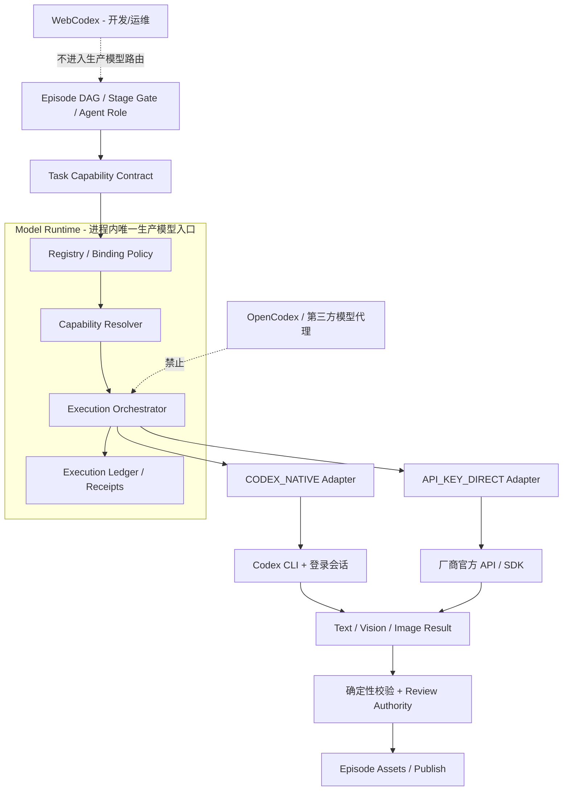
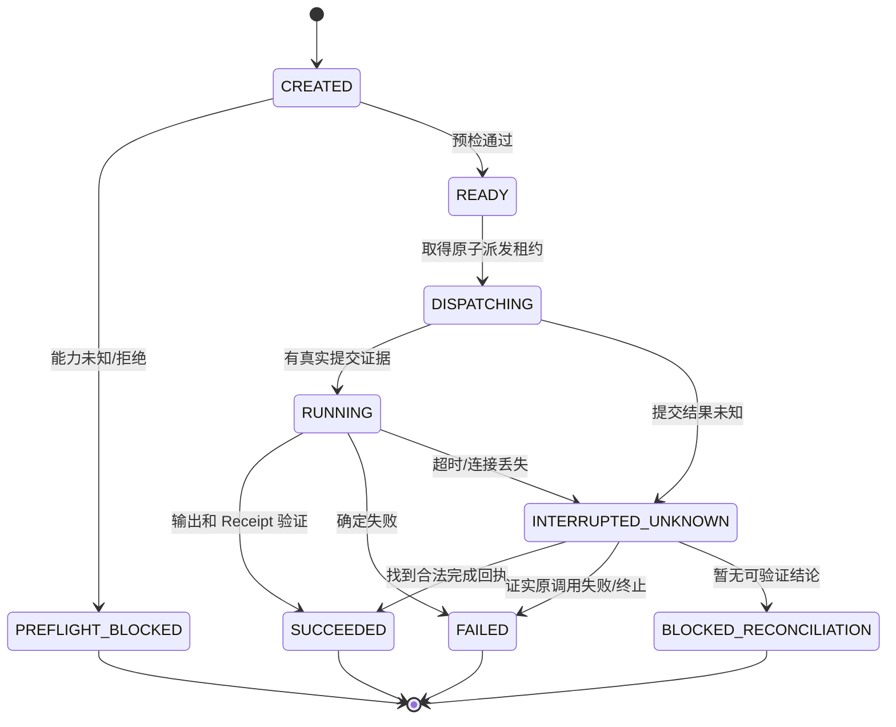

# StoryOS 模型底座双通道收敛与生产闭环最终实施方案

> 版本：v1.0 · 日期：2026-10-09
> 性质：架构决策 + 代码审计清单 + 实施任务书 + 验收规范
> 建议落地位置：`docs/StoryOS_模型底座双通道收敛与生产闭环最终实施方案_20261009.md`
> 实施范围：StoryOS LOCAL 图文故事生产系统（**不引入图片转视频/视频生成**）
> 当前状态：**方案待实施；不是生产通过报告**。

---

## 0. 执行摘要（最终决策）

**StoryOS 生产模型执行只允许两种通道：`CODEX_NATIVE` 与 `API_KEY_DIRECT`。**

- `CODEX_NATIVE`：默认。由本机 Codex CLI 与合法登录会话执行；模型和工具能力按当前会话的真实证明判定。
- `API_KEY_DIRECT`：可选。通过经过批准的厂商**官方 API/SDK**直接调用；密钥不进入故事资产或执行日志。
- **`OPENCODEX` 及其他模型中转/兼容代理：退出生产模型执行链路。** 不接受代理绕过，不以故障自动回退到代理。
- **`WEBCODEX`：仅作为开发/运维入口，不能成为 StoryOS 生产 Agent 的模型 Provider、前置依赖或隐式回退。** WebCodex 在线与否不得决定 LOCAL 生产能否执行。
- 统一一个进程内的 **Model Runtime**，由 `Model Registry`、`Capability Resolver`、`Execution Adapter`、`Execution Ledger` 组成。当前阶段**不新建微服务、不新增模型网关**。
- **不默认在 Codex 与 API Key 之间自动切换。** 超时/未知执行状态必须先对账，再显式重新派发；禁止重复生图、重复扣 Attempt、伪造 Review PASS。
- **保留既有 StoryOS Episode DAG、Stage Gate、Frame Contract、视觉档案、真实 Receipt 与出版流程**；通过兼容适配器逐段替换旧入口，不一次性重写。
- SQLite 是 LOCAL Runtime 的**后续可选存储收敛**，不能先于权威状态审计和可逆迁移切换；不把“接入 SQLite”视作模型底座完成的前置条件。

**先恢复真生产（P0），再抽象统一能力（P1），再清理旧通道（P2），最后以量化证据做瘦身（P3）。**

### 本文用语

| 词 | 本文唯一含义 | 不等于 |
|---|---|---|
| Model | 具体模型/版本或逻辑模型绑定 | Provider、Runtime |
| Provider | 能力提供厂商/账号体系 | 代理程序 |
| Transport | 实际调用通道：`CODEX_NATIVE` / `API_KEY_DIRECT` | 模型名称 |
| Adapter | 某 Transport 的实现 | 新微服务 |
| Capability | 任务所需真实能力，例如图像生成、视觉理解 | 配置声明即已授权 |
| Agent | 业务角色：故事、分镜、审核等 | 一个固定模型 |
| WebCodex | 工程运维工具 | 生产模型 Provider |
| OpenCodex | 曾存在的模型代理/兼容通道 | 原生 Codex |

---

## 1. 范围、事实基线与不确定性

### 1.1 会话中已有的事实证据

根据此前对 StoryOS 工作区的实际检查和本会话已完成的测试：

1. StoryOS 有 `codex_user_runner.py`、`codex_subscription_image.py`、`image_payload_transport.py`、`image_worker_pool.py`、`image_scheduler.py`、`frame_semantic_review.py`、`review_queue.py` 等执行/审核模块。
2. 项目曾存在 OpenCodex 图像路由和代理兼容判断；隔离修复工作树中已增添对非原生图像 Provider 的拦截与测试。**这不能证明主分支旧通道已彻底删除。**
3. `CODEX_NATIVE` 真实图像路径在 **TEST_ONLY Canary** 中生成过像素和归一化 PNG；其效果不等于正式 Episode 阶段门禁已通过，也不能推断一个配置模型名就是实际执行模型名。
4. TEST_ONLY Canary 图像已生成、Fast Scout 已完成，但 Final Semantic 曾处于 `running` 且缺少最终提交回执。必须将“审核候选”与“经授权的最终审核结果”分开。
5. 早先隔离工作树四组回归曾报告 **216 项 pytest 通过，另有 2 项子测试通过**。这些是当时隔离分支的局部回归证据，**不是全项目/当前主分支的验收结论**。
6. 建议继续在隔离 worktree `storyos-native-image-repair-20261008` 对已有补丁进行复核和提交，避免覆盖主工作区同期修改。

### 1.2 当前仍然必须通过只读审计确认

- 现在主分支究竟还有多少 `opencodex` / `webcodex` / 自定义 `base_url` / Provider 隐式代理可达分支。
- `API_KEY_DIRECT` 是否已有可用的**官方 SDK 直连路径**，支持哪些模态、正式执行还是测试夹具。
- `Model Policy`、Provider 配置、环境变量与 Agent 参数之间的最终优先级。
- Runtime 的执行事实究竟落在 MySQL、SQLite、Redis、文件或多处投影；哪些是唯一 Authority。
- Codex CLI 登录/工具权限证明是否能在本次 Session 取得；不能把配置功能开关当能力证明。

**状态标记原则：`已证实` / `代码已改待合并` / `待核查` / `待实现` / `生产通过` 必须分开。** 不得把本方案或单测成功记为“已上线”。

---

## 2. 目标架构与分层职责



### 2.1 仅保留四个核心职责

| 模块 | 负责 | 明确不负责 |
|---|---|---|
| Model Registry | 逻辑模型档案、任务能力声明、Provider/Transport 允许列表、版本/策略绑定 | 证明当前登录会话已授权工具 |
| Capability Resolver | 当前运行环境、会话、模型及工具的可用性判断；产出可追溯证明 | 生成假证明、用历史成功代替当前会话证明 |
| Execution Orchestrator + Adapters | 任务入参合同、预算、派发和模态返回；仅调用两种已准许通道 | 把 WebCodex/OpenCodex 当兜底 Provider |
| Execution Ledger | 调用事实、请求身份、回执、状态对账、审计与恢复；复用已有 Authority | 再建立一套平行、互相矛盾的权威事实表 |

保留三种**模态处理器** `Text` / `Vision` / `Image`，但共享调用元数据和 Ledger。Vision 审核结果必须由独立 Review Authority 决定，Adapter 自己无权批准 Episode 进阶。

### 2.2 模型角色与执行通道解耦

Agent 提交：`任务类型 + 所需能力 + 输入合同 + 预算 + 合法模型绑定`。Model Runtime 才解析具体通道。**模型别名不能冒充模型 ID；Transport 不能冒充模型能力。**

例如：`story.generate → reasoning + text_generation`，`image.generate → image_generation`，`vision.review → vision_understanding + semantic_review`。同一绑定在一个锁定 Episode 中保持稳定；需要切换时产生新的 Policy Version/Execution Identity，不得复用旧回执。

---

## 3. 强约束（不可回退的架构决策）

1. `allowed_transport == {CODEX_NATIVE, API_KEY_DIRECT}`，大小写/旧别名只在读取老配置时规范化，不成为新的外部执行路径。
2. 默认 `CODEX_NATIVE`。`API_KEY_DIRECT` 必须显式配置 Provider、模型能力、认证和官方 Endpoint 约束。
3. 禁止 `opencodex`、WebCodex-as-Provider、自定义未批准模型代理、静默代理链、不可审计 URL 重写、隐式 Fallback。
4. `CODEX_NATIVE` 既可以使用 Codex 登录会话，也可能由 Codex CLI 支持其他合法认证方式；**调用仍归类为 `CODEX_NATIVE`，绝不冒称为 SDK 直连**。
5. `API_KEY_DIRECT` 指 StoryOS **自己通过厂商正式 SDK/API** 发请求，不等于“用 API Key 登录 Codex CLI”。
6. 禁止因为图像模型暂不可用而自动切成文本假结果、占位 PNG、Fixture、HTTP 代理或“成功”状态。
7. 图像是正式图文交付资产；保持无视频工作流。字幕使用经过用户确认的最终图片，避免覆盖 `publish` 人工定稿。
8. 生产不能依赖 WebCodex 服务持续在线；WebCodex 只用于开发、审查、修复、运维指令。
9. `CODEX_NATIVE` 和 `API_KEY_DIRECT` 均须输出统一身份与执行证据；**无法独立证明实际模型版本时标记 `UNKNOWN`**，不得把请求值写成“实际使用”。
10. 在证明已安全终止原调用前，**禁止超时自动跨通道重试**。对可能已扣费但回执丢失的任务先对账/阻断。

---

## 4. 配置收敛方案

### 4.1 建议新增唯一权威配置（示意，尚非当前代码支持语法）

```yaml
model_runtime:
  schema_version: 1
  default_transport: CODEX_NATIVE
  allowed_transports: [CODEX_NATIVE, API_KEY_DIRECT]
  allow_implicit_fallback: false
  allow_unapproved_base_url: false

  transports:
    CODEX_NATIVE:
      executable: codex
      auth_mode: login_session
      probe_strategy: session_scoped
    API_KEY_DIRECT:
      provider: openai   # 仅示例，必须是 approved_provider 列表之一
      auth_mode: api_key_env
      key_env: OPENAI_API_KEY
      endpoint_policy: vendor_official_only

  bindings:
    story.generate: {transport: CODEX_NATIVE, model_profile: text_reasoning}
    storyboard.generate: {transport: CODEX_NATIVE, model_profile: structured_reasoning}
    prompt.compile: {transport: CODEX_NATIVE, model_profile: structured_text}
    image.generate: {transport: CODEX_NATIVE, model_profile: native_image}
    vision.review: {transport: CODEX_NATIVE, model_profile: visual_semantics}
    semantic.review: {transport: CODEX_NATIVE, model_profile: bounded_final_review}

  policy:
    binding_locked_per_episode: true
    block_on_capability_unknown: true
    charge_attempt_only_on_confirmed_dispatch: true
    require_execution_reconciliation_before_retry: true
```

**补充说明：** `charge_attempt_only_on_confirmed_dispatch` 是 StoryOS 内部 Attempt 计数规则；不意味着厂商只在有本地 Receipt 时才计费。若已发出请求、结果未知，要保留可能产生外部成本的事实，而不是自动重新请求。

**禁止把密钥写进配置文件。** 上例的 `key_env` 只是环境变量名称，生产时采用受控运行环境或密钥存储；输出日志必须脱敏。

### 4.2 单一优先级

**锁定的 Episode Binding（已解析版本） > 经过授权的显式 Runtime Override > 统一模型策略默认值。**

- 环境变量**只能提供凭证/运行时地址等受控参数**，不得悄悄改变模型生产 Transport。
- 一切历史 `STORY_OS_IMAGE_PROVIDER_ROUTE`、`OPENCODEX_*` 之类参数必须先枚举并映射至明确的禁止/迁移错误；移除前为旧调用提供明确拒绝提示。
- 旧 Agent 配置文件可暂保留兼容解析，但只能**映射到新策略**，不能产生第二份真实决策。
- 将 `requested_transport`、`effective_transport`、`policy_version` 和 `capability_status` 展示在生效配置快照中，不泄露 Secret。

---

## 5. Capability Resolver：能力声明不能冒充可用性

### 5.1 判定状态

| 状态 | 含义 | 处理 |
|---|---|---|
| `DECLARED` | Registry 声明可能支持此能力 | 不可直接放行生产调用 |
| `AVAILABLE` | 当前会话/Provider 通过有约束的检查，可实际调用 | 可提交符合合同的执行请求 |
| `VERIFIED` | 此次任务产生经检验的真实执行结果和回执 | 可供相应后续 Gate 验证；不直接等于审核 PASS |
| `UNKNOWN` | 无法证明能力是否可用 | `BLOCKED`，输出恢复动作；禁止伪证明 |
| `DENIED` | 已确认权限、工具或路由不可用 | 快速失败，不进入图片派发 |

### 5.2 证明范围与失效

Capability Proof 至少绑定：`session_fingerprint`、`provider`、`transport`、`capability`、`requested_model`、`runtime_version`、`policy_version`、`observed_at`、`evidence_reference`。其有效范围应与会话及任务约束一致。

Codex CLI 功能开关、配置模型名和一次过去的 TEST_ONLY 成功，**均不能被误写为本次正式 Episode 的模型工具已授权**。能力 API 不存在时允许“受限真实 Canary”，但必须：限定测试工作区、Episode 白名单、真实 Attempt 预算、明确授权、无发布权限、不污染生产 Authority、产生真实回执。

### 5.3 最小 API 契约（逻辑字段）

```python
class CapabilityRequest:
    role: str
    capabilities: list[str]
    transport: str
    session_fingerprint: str | None
    policy_version: str

class CapabilityDecision:
    state: str       # AVAILABLE | UNKNOWN | DENIED
    proof_ref: str | None
    failure_code: str | None
    recovery_action: str | None
```

**禁止**利用 `CODEX_NATIVE` 失败后自动请求 `API_KEY_DIRECT` 的“能力检测”；只有已被明确批准、不会产生成本或已单独授权限额的探测才允许执行。

---

## 6. 执行合同与回执（Execution Ledger）

### 6.1 一次调用的唯一身份

- `execution_id`：一次真实尝试的全局唯一 ID；同一执行恢复时不另造新 ID。
- `task_key`：稳定逻辑任务标识，如 Episode + Frame + Contract Version。
- `idempotency_key`：避免本地重复派发；**不能假设第三方 API 提供同等幂等保障**。
- `requested_model` 和 `actual_model` **分字段记录**。若无法获取实际模型身份，`actual_model=null` + `attestation_status=UNKNOWN`。
- `input_sha256`、`frame_contract_sha256`、`prompt_sha256`、`artifact_sha256` 明确关联；图片须通过像素尺寸、文件完整性和来源验证。
- `transport`、`provider`、`policy_version`、`capability_proof_ref`、`provider_receipt_ref`、`attempt_index`、`started_at`、`finished_at`、`cost_metadata_if_known`、`status`、`failure_code`。

### 6.2 推荐执行状态机



**租约过期不等于上游模型已停止。** 超时恢复顺序：检查运行进程/Job → 读取原执行身份下的持久回执 → 核对产物与 Hash → 修复 Ledger 投影 → 只有确认旧执行终止/不存在且允许再次调用时，才建立新的 Attempt。

不得为了避免无限 `running` 就将有有效租约的任务直接标记成孤儿。有效租约必须保留；过期但结果未知的任务进入显式 `BLOCKED_RECONCILIATION` 或同等受控状态，Scheduler 返回非成功码和恢复动作。

### 6.3 Review Authority 不得降级

- `Fast Scout` 可做确定性规则校验、初步视觉检查，但不替代 `Final Semantic`。
- `Final Semantic` 产生的 Candidate `pass` **不是**正式 Review Authority PASS。
- 只有具备模型执行回执、输入合同 Hash、一致的 Epoch/Authority 身份及原子写入的审查 Commit，才可以用于 Stage Gate。
- 同一个 Execution/Review ID 的提交应幂等；冲突时拒绝覆盖并对账。
- 调度完成码必须综合**图片任务 + 审核任务 + Authority**，不能仅凭“25 张图片存在”认定完成。

### 6.4 复用既有数据，不制造第二套真相

先画出 MySQL、文件 Receipt、Redis（如仍启用）、SQLite 之间的**读写依赖与权威归属图**。优先在现有权威提交路径加统一 Execution ID 和引用索引，旧投影继续只读用于验证；禁止未经批准同时向两套 Authority 双写。

---

## 7. 文件级改造范围与删除策略

> 下列为**优先审计的已见或前述文件/逻辑**，不是声称当前主分支已经按建议改完。实施前以最新 `rg`、Git 状态和调用图为准。

| 现有位置/概念 | 建议处理 | 完成标志 |
|---|---|---|
| `codex_user_runner.py` | 保留底层原生 CLI 执行；抽出 `CodexNativeAdapter` | 文本、视觉、图像（仅实际支持项）都走统一合同 |
| `codex_subscription_image.py` | 保留真实图像执行与像素处理；剥离代理例外 | 请求来源与像素回执一致，无代理旁路 |
| `image_payload_transport.py` | 收敛为明确的允许列表或委托 Model Runtime | 非两种通道不可达且测试拦截 |
| `image_worker_pool.py` | 只做资源/并发/Worker 生命周期管理 | 不绕过能力证明，不私自切 Provider |
| `image_scheduler.py` | 消费 Ledger/Review 真状态并做安全恢复 | 无主审核不会重派、有效租约不误隔离 |
| `review_queue.py` | 明确租约归属、回执对账与阻断状态 | 过期未证实执行不能自动重发 |
| `frame_semantic_review.py` / Critic Runner | 统一执行身份与候选/正式审批边界 | Candidate PASS 不会自行晋级 |
| `effective_config.py` | 展示唯一生效配置、当前能力状态 | 与真正 Executor 选择一致 |
| `config/storyos.yaml` 等策略文件 | 收敛 Authority，迁移旧配置 | 单一来源，旧字段冲突时报错 |
| OpenCodex 专属 Runner/Env/Adapter | 先清点引用，再隔离、删生产路径与死代码 | 静态扫描和动态路由测试都无可达调用 |
| WebCodex-as-Model 的生产入口（如存在） | 删除其业务调用/兜底分支 | LOCAL 生产离线也可执行 |
| `API_KEY_DIRECT` Adapter | 对批准厂商逐项实现官方 SDK 请求及响应验证 | 独立合同测试与受控真实 Canary 通过 |

### 7.1 必须执行的主分支只读扫描

```bash
# 主分支与隔离分支各执行一次，并分别保存证据；不要把历史文档提及当作“可执行路径”
rg -n -i 'opencodex|webcodex|STORY_OS_IMAGE_PROVIDER_ROUTE|CODEX_NATIVE_IMAGE_PROVIDER_REQUIRED' .
rg -n -i 'base_url|proxy_url|provider_route|fallback|api_key|OPENAI_API_KEY|codex exec' config episodes platform scripts
rg -n 'subprocess|Popen|requests\.|httpx\.|openai\.|invoke_model|model_policy' episodes/_system platform
```

对每个命中分类：`生产可达` / `测试` / `文档历史` / `运维工具` / `非模型网络代理`。**只能针对生产可达的非授权模型路由删除/封堵；不能看到 proxy 字样就删掉企业网络所需的常规代理代码。**

### 7.2 禁止“清理式”危险操作

不得执行 `git reset --hard`、`git clean -fd`、强制覆盖、对主工作区全目录替换、清空用户图片/字幕/`publish` 目录、未经验证的 DB 迁移。任何并行工作的文件所有权必须明确；冲突以小批次评审和安全合并解决。

---

## 8. 四槽位滚动实施（必须真并行、不同文件所有权）

| 槽位 | 主责 | 边界文件/模块 | 交付成果 | 验收门禁 |
|---|---|---|---|---|
| **A：Registry/Policy** | 主分支审计、能力档案、单一模型绑定、配置冲突拦截 | 新 `model_runtime/registry*`, `capability*`，配置迁移；不改 Worker | 统一 Registry + Resolver，静态扫描报告 | Declared≠Available；非法通道快速拒绝 |
| **B：Adapters** | 原生 Codex 执行合同、API Key 官方直连适配器 | `codex_user_runner`, `codex_subscription_image`, adapter | 两个正式 Transport，Text/Vision/Image 契约 | 原生真实图像回执 + API 独立 Canary（授权时） |
| **C：Ledger/Review** | 执行 ID、Attempt、无主租约处理、Review Authority 原子提交 | `review_queue`, `frame_semantic_review`, Ledger/recovery | 超时对账、不可重复派发、错误码可恢复 | 审核超时/崩溃/重入故障注入通过 |
| **D：Performance/LOCAL** | 去重复调用、缩小 Review 上下文、存储 Authority 审计和 SQLite 隔离原型 | 审核输入编译、metrics、SQLite probe | 基线指标、减负实验、存储迁移报告 | 语义质量不退化、CAS/回滚测试通过 |

**并行规则：** 4 槽位是**工程并行开发/验收**，不是 `image_worker_pool.max_inflight_images=4`；二者不能混为一谈。每槽独立目录/工作树，拥有明确文件集合；共享的 `model_runtime` 接口先冻结合同，再并行实现，不接受四槽同时改一个文件。

### 8.1 分阶段合并，不边做边破坏生产

**P0：修当前中断链路（阻断优先）**

1. 检查隔离 worktree 与主线差异；复跑此前已经通过的原生 Codex/Controller/Scheduler/Review 相关测试。
2. 修正 Final Semantic 恢复：**有效租约保留**；过期无回执时禁止重复派发；有回执则核验并原子提交；不能确定则显式阻断。
3. 检查 Scheduler 完成状态确实包含 Review Authority；确保无伪 PASS 和失败转成功。
4. 按文件范围提交隔离补丁，并与当时主线逐文件对比、回归后再合并；不得覆盖同期改动。
5. 在明确授权与能力证明满足条件下，使用**已有**正式 Episode 的 M00 小范围真实生产验证，再扩至正式图片/字幕。不以 TEST_ONLY 取代生产。

**P1：双通道并存（最小可用统一 Runtime）**

1. 冻结统一 Task/Capability/Execution/Receipt 合同与 schema version。
2. Registry + Resolver 先用兼容适配器包住旧 Runner；旧路径不许绕过 Resolver。
3. CodexNativeAdapter 绑定原生 CLI；APIKeyDirectAdapter 绑定已批准厂商官方 SDK 和模型能力。
4. 先在**不增加真实生产调用成本**的层面比对新旧路由决策，Shadow 只读；确认一致后按任务逐项切换。

**P2：旧路由硬退役**

1. 配置层拒绝 `OPENCODEX` / WebCodex Provider 和未审批 `base_url`；禁止非授权代理回退。
2. 对历史配置迁移提供确定性错误提示和可逆映射；明确报错后删除无法再达的代理代码、测试假设和启动脚本。
3. 为“Codex 本地不可用”增加真实阻断提示和恢复文档；绝不隐式切换 API Key。

**P3：性能和 LOCAL 存储收敛**

1. 统计各阶段 wall time、模型输入/输出 token（可得时）、模型调用次数、重复校验数、失败恢复耗时、实际图像数和审核失败率。
2. 能用本地代码确定的问题先由本地解决（SHA、尺寸、配置、字幕格式、队列状态）；只有真正语义判断走模型。
3. Final Semantic 只给**必要的帧、参考图、角色与合约上下文**；按正确性对照集验证，不为了减少 token 偷删必要证据。
4. SQLite：只在 LOCAL 模式经过 Authority 映射、读写回放、CAS、WAL、进程崩溃、备份/恢复和双向对账后考虑正式切换。未通过就继续 MySQL，不耽误模型底座上线。

---

## 9. 可执行测试矩阵与退出门禁

### 9.1 必测场景

| ID | 场景 | 必须观察到的行为 |
|---|---|---|
| ROUTE-01 | 默认无覆盖配置 | 选择 `CODEX_NATIVE` |
| ROUTE-02 | 显式绑定 `API_KEY_DIRECT` | 只使用官方批准 Provider 的 SDK；凭证脱敏 |
| ROUTE-03 | 环境试图选择 `opencodex` | **拒绝**；无 Provider 副作用 |
| ROUTE-04 | WebCodex 服务离线 | LOCAL StoryOS 不因其离线而切换/阻断模型路线 |
| ROUTE-05 | 旧环境变量与新策略冲突 | 配置验证失败，而非静默取其一 |
| CAP-01 | CLI 开启 image feature，但工具不可验证 | `UNKNOWN/BLOCKED`，不生成成功证明 |
| CAP-02 | 实际原生图像工具可用 | 真实生成像素、正规化、回执/哈希验证 |
| CAP-03 | 请求模型与实际模型证明不一致/未知 | 保留 requested/actual 差异；严禁虚构身份 |
| EXEC-01 | 未提交请求前预检失败 | 无下游调用、不消耗实际生图 Attempt |
| EXEC-02 | API 发出后连接丢失 | `INTERRUPTED_UNKNOWN`，不自动跨通道重派 |
| EXEC-03 | 两 Worker 同时认领一任务 | 仅一个获得原子派发权 |
| EXEC-04 | 旧执行已成功但 Ledger 还没提交 | 根据同一 ID 对账，不重新出图 |
| REVIEW-01 | Candidate 标记 `pass`，无正式回执 | 不能提交 Review Authority |
| REVIEW-02 | `Final Semantic running` 且租约**有效** | 不隔离、不重复领用 |
| REVIEW-03 | `Final Semantic running` 租约**过期**且无可验证终态 | 进入受控阻断，提供恢复动作；不再次调用 |
| REVIEW-04 | 过期任务有可靠终态 Receipt | 按原身份原子 Commit，可幂等回放 |
| REVIEW-05 | 图片全部成功、Final Semantic 阻断 | Scheduler 返回未完成/阻断，不可 `PUBLISH_READY` |
| CONFIG-01 | 配置快照展示 effective route | 与真实请求回执匹配、不泄露密钥 |
| LOCAL-01 | SQLite 同 Key 并发 CAS | 只有一个竞争者成功，修订号连续 |
| LOCAL-02 | SQLite 崩溃/回滚 | 不丢已提交事实、不重放成双权威 |
| REGRESS-01 | 主线全项目回归 | 通过；无旧兼容路径依赖残留 |
| PROD-01 | 已授权正式 Episode M00 → 生产链 | 真实图片、字幕、审核和阶段门禁全有可靠证据 |

### 9.2 发布门禁

只有同时满足下列项，才可将本方案记为 **DONE**：

- 静态可达调用图证明生产仅有 `CODEX_NATIVE`/`API_KEY_DIRECT` 两个 Transport；动态负向测试证明 OpenCodex/WebCodex 模型入口被拦截。
- API Key Direct 不是配置占位，而是在经过授权的测试资源上证明请求/返回/限额/安全错误/Receipt 路径有效；若未授权真实测试，标记该通道 `INTEGRATION_PENDING`，不能宣称全量 DONE。
- `CODEX_NATIVE` 测试包含真实像素，正式 Episode 与 TEST_ONLY 各自满足自己的独立验收规则。
- `Review Authority`、`Execution Ledger` 有清晰单一责任和持久化边界；超时、断链、并发、重放测试全部通过。
- 已有故事和图片资产不被覆盖；完整回归与 `git diff --check` 通过，合并说明记录受影响路径。
- 有 before/after 的真实指标；无法证明提速时如实标记 `QUALITY_VERIFIED / SPEED_UNMEASURED`，不承诺任意百分比。
- 正式生产从当前真实锁定 Stage 完成指定 Episode 目标资产和字幕且获得合法 Stage Gate 回执；**不得伪造 `PUBLISH_READY`**。

---

## 10. 迁移与回滚

1. **冻结基线：** 记录主分支 HEAD、远端关系、未提交文件清单、数据库 Authority 入口、当前正式 Episode 阶段及历史产物 Hash；不做清理式 Git 操作。
2. **隔离实现：** 每槽位单独工作树/文件清单，首批只做只读审计；每个补丁落测试与日志。
3. **兼容读取：** 旧 Registry/Policy 配置经受控映射进入新 Runtime；旧执行仍保持现有合法逻辑，不扩充旧代理通道。
4. **分批切换：** 先 `CODEX_NATIVE` 文本，再视觉，再图像；`API_KEY_DIRECT` 在独立认证/额度测试成功后才逐个任务启用。
5. **回滚边界：** 配置切回最后已验证的**允许通道/已锁定模型策略**；只回滚代码和未发布策略，**不删除已产生的真实 Receipt、Attempt、计费证据与用户资产**。
6. **旧代码删除：** 在路由负向测试和所有正式入口调用图确认后，才移除代理实现；保留必要迁移说明，不保留可执行的备用绕路。

### 主分支合并前检查

```bash
git fetch
git status --short
git log -12 --oneline --decorate
git rev-list --left-right --count HEAD...origin/story-platform-v3-rever
# 注意按当前真实远端名称判断；绝不根据历史预期强行 reset。
```

记录独立 worktree 的提交 SHA，进行**定向变更审查 + 全量回归**后合并。现有正式 `publish` 图片是用户资产，未经授权禁止替换/重新出图。

---

## 11. 工作项与交付物（分槽记录）

| 编号 | 工作项 | 优先级 | 槽位 | 验收证据 | 初始状态 |
|---|---|---|---|---|---|
| MC-001 | 全部模型与代理可达路径、配置优先级审计 | P0 | A | `model_transport_inventory.md` + grep/调用图 | 待执行 |
| MC-002 | Final Semantic 有效/过期租约安全恢复 | P0 | C | 故障注入、回执对账、无重复派发 | 代码已有部分改动，待最终验收 |
| MC-003 | Codex 原生图像与 Review Authority 正式闭环 | P0 | B/C | 正式 M00 真实像素与审批回执 | 待完成 |
| MC-004 | 统一 Model Registry 和绑定决策 | P1 | A | 单一生效配置、冲突拒绝 | 待实现 |
| MC-005 | Session Capability Resolver | P1 | A | UNKNOWN/DENIED/AVAILABLE 负面测试 | 待实现 |
| MC-006 | CodexNativeAdapter / 同一执行合同 | P1 | B | 真实模型回执，三模态合同 | 待收敛 |
| MC-007 | APIKeyDirectAdapter 官方 SDK | P1 | B | 授权真实 Canary、脱敏、错误分类 | 待核查现有实现后补齐 |
| MC-008 | Execution Ledger 原子化与状态投影清理 | P1 | C | 并发、崩溃、幂等回放 | 待收敛 |
| MC-009 | OpenCodex/隐式代理生产路径退役 | P2 | A/B | 静态 + 动态负向验证，旧脚本清理 | 待核查主分支 |
| MC-010 | Review 输入瘦身与性能基线 | P3 | D | 耗时、Token、质量对照 | 待实施 |
| MC-011 | SQLite LOCAL Authority 映射与迁移评审 | P3 | D | 对账、并发、回滚、恢复报告 | 隔离 CAS 原型已有，不代表迁移完成 |
| MC-012 | 正式 Episode 全链生产验收 | 发布门禁 | A/B/C/D | Stage Gate、图片、字幕、用户定稿未覆写 | 未完成 |

每个工作项关闭时必须附：`改动文件 + 测试命令 + 测试结果 + 真实运行证据（如适用）+ Git 提交 + 未关闭风险`。不允许单靠口头“完成”清零。

---

## 12. 非目标（防止方案再次变重）

- 不做通用云端模型 PaaS、不新建 API Gateway、不另起复杂的 Agent 平台。
- 不通过 OpenCodex 获得图片能力，不支持第三方中转作为故障备份。
- 不把 WebCodex Runner 池大小或“4 个开发槽位”绑定为 StoryOS 生产调度配置。
- 不用测试夹具生成正式媒体，不通过写数据库伪造生产成功。
- 不因本轮模型底座改造顺手修改所有故事生产规则；保存 Episode 合同与已确认的图像资产。
- 不引入 `video_assembler`、视频生成或图片转视频步骤。
- 不把 SQLite 迁移作为 P0 阻断项，不在生产 Authority 仍有多处写入时盲目迁移。

---

## 13. 最终验收结论模板（执行后填写）

```text
变更分支 / HEAD：
主分支与远端 ahead/behind：
CODEX_NATIVE 正式运行证据：
API_KEY_DIRECT 正式运行证据：
OpenCodex/WebCodex 生产入口扫描：
Capability Resolver 真实能力证明：
Final Semantic Authority 状态：
中断/重启/重复派发测试：
Episode 正式 M00 状态：
正式图片、字幕、publish 状态：
回归：X passed / Y failed / Z skipped
基线与优化后性能：
未关闭风险：
结论：DONE / PARTIAL / BLOCKED
```

**最终一句话：** StoryOS 的业务层只提交能力要求，底层只有一个统一模型执行入口、**两种允许 Transport**，并用真实能力证明和执行账本保证“能调、调对、能恢复、可追溯”。OpenCodex 退出生产，WebCodex 只做工程工具，先把 Codex 原生真实生产跑通，再在正式授权和验收后增加 API Key 直连。

## 14. 隔离分支实施记录：2026-10-09 / Shadow Slice 1

> 此段是实际代码与测试进度记录，不是 Production Cutover、模型工具证明或完整故事生产验收。

- **隔离 Git 分支：** `feature/storyos-model-runtime-v1`；入口基线 `ea6f917`，文档引导提交 `654c7a3`。
- **P0 新增 Shadow 层：** `episodes/_system/model_runtime_v1/`，不修改生产 DAG、Agent 或 Image Scheduler 的执行路由。
- **Registry（A）：** 复用 `model_policy.resolve(role, episode)` 的冻结策略；仅允许 `CODEX_NATIVE` / `API_KEY_DIRECT`；区分请求模型与真实模型。
- **Capability Resolver（B）：** `DECLARED` 不可当作 `AVAILABLE`；作用域、失效时间与可信验证接口缺一不可。当前可信验证器接线仍待落实到正式 Codex 运行时。
- **文本 Adapter（B）：** 原生 Codex 固定官方后端，不使用 `OPENAI_BASE_URL` 代理覆盖；API Key 采用固定官方 Responses URL；显式授权才派发。返回 `REQUIRES_VALIDATION`，不能直接变成 Review PASS。**本轮没有执行真实收费调用**；视觉和图像功能不通过文本适配器偷跑，沿用既有图像入口，正式迁移尚未实施。
- **Ledger View（C）：** 只有派生合同，没有第二套持久权威；`INTERRUPTED_UNKNOWN` 不允许盲目重试。Provider Receipt 的真实持久化及 Review Authority 原子提交继续使用已有仓库实现，切换待验收。
- **Legacy Audit（D）：** 只读扫描发现 `codex_user_runner.py` 26 行相关命中、`codex_subscription_image.py` 4 行、`image_payload_transport.py` 2 行、Provider Runtime 配置 2 行、`config/storyos.yaml` 7 行。这是行级审计证据，**不是可删除入口数量**；未动旧代理执行代码。
- **基线漂移修复：** `tests/system/test_model_policy_contract.py` 的 `vision.fast` 旧预期为 `low`，而 `ea6f917` 的实际配置为 `high`；仅在隔离分支调整测试期望，**未修改生产模型推理配置**。

### 独立回归（同一轮，无重叠测试文件）

| 槽位 | 范围 | 结果 |
|---|---|---|
| A | 新 Registry + 原模型策略 | 27 passed |
| B | Capability、双通道文本 Adapter、旧 Codex Runner | 34 passed |
| C | Ledger、Generation Attempt | 4 passed / 8 skipped |
| D | 旧代理审计、Shadow 端到端、Image Provider | 15 passed |
| 合计 | 四组彼此不重叠 | **80 passed / 8 skipped** |

### 下一轮必须完成

1. 将 Model Runtime 的可信证明接口接入真实 Codex Runner（实际工作会话工具证明），禁止以单测 Callback 替代运行时证明。
2. API Key Direct 完成官方调用失败分类、超时状态与受控模型 Canary；图像继续通过专属官方图像适配器，不通过 Text Adapter 生成图片。
3. 逐条分类 `codex_user_runner.py` 的自动 OpenCodex 路由；完成用户批准的兼容性回归后再删实际可达分支。
4. 接入现有 Execution/Provider Receipt/Review Authority；验证重复回执、过期租约、有活跃 Worker、MySQL 故障与恢复。
5. 真正走完正式 Episode 的 M00 → 图片 → 字幕 → Publish Gate 后，才可申请主分支集成；此 Shadow 阶段严禁声称已到达 `PUBLISH_READY`。

**实施状态：SHADOW_IMPLEMENTED / NOT_PRODUCTION_CUTOVER**。

## 15. 隔离分支实施记录：2026-10-09 / Shadow Slice 2

> 状态：**SHADOW_ONLY**。以下测试为隔离分支代码回归，不是现实生产通道切换或真实模型付费调用。

### 四槽改动

- **A / 签发保护：** 文本调度计划由 `TextDispatchPlan` 包装为不可变、在本地登记身份的对象，伪造的普通字典不能直接通过派发入口。可信证明仍由具备真实运行时证据的调用端验证，不把自报字段 `verified_capability=True` 当成 Authority。**尚未实现正式证明提供者，不能切生产**。
- **B / 原生 Codex 与 API Key：** 标准输入改为显式 `input=prompt, text=True, encoding=utf-8`，覆盖直连与用户态桥接共用接口；删除继承的 `OPENAI_BASE_URL` 覆盖且在命令参数中明确原生后端；Codex 空输出不视为成功；API Key 直连仅允许固定官方 Responses URL，4xx 明确拒绝脱敏、未知网络异常保持 `OUTCOME_UNKNOWN`，不自动换通道重试；非完整响应被拒绝。图像继续使用原生图像专用链路，未接入文本 Adapter。
- **C / Receipt 只读对账：** 新增 `receipt_reconciliation.inspect_existing`，委托已有 `provider_receipt_persistence.load_by_path` 读取：缺失、兼容 JSON、MySQL 回执、Attempt/SHA 不一致均明确分类；即使匹配 MySQL 回执，仍 `can_finalize=False`、`review_authority_granted=False`，必须由既有 Attempt/Review Authority 实际验收。**未建立第二数据权威**。
- **D / 旧代理分类：** 新增 `legacy_classification`，把 OpenCodex 动态回退、WebCodex 工作区、官方 Image API、历史 Provider 路由分开处理；任何命中均不授予自动删除权限。旧生产 Runner 尚未删除或切换。

### 独立回归

| 组 | 范围 | 结果 |
|---|---|---|
| A | Registry / Capability / 原 Model Policy | 32 passed |
| B | Text Adapters / 原 Codex Runner / Shadow Gate | 38 passed |
| C | Ledger / Receipt reconciliation / MySQL Receipt Contract | 9 passed |
| D | Legacy scanner / classification / 旧 Image Provider | 16 passed |
| 补充 1 | 旧 Image Payload / Controller 兼容 | 60 passed，另有 7 项子测试通过 |
| 补充 2 | 旧 Review Queue / Generation Review / Receipt Recovery | 13 passed |
| **合计** | 同轮不重复测试文件 | **168 passed，另有 7 项子测试通过** |

### 强制未完成门禁

1. 可信能力证明需接入正式运行时原始事件/Session Identity；`trusted_verify` 测试注入不是生产证明。
2. API Key Direct 尚未在合法模型/密钥/正式额度上做真实受控 Canary，不能标记上线。
3. `codex_user_runner.py` 的既有 OpenCodex 自动探测尚未删除，旧生产调用仍可能到达代理。
4. 必须验证原生 Codex 实际进程与真实输出回执（而不是只用 Stub）；同时保持正式图片 Attempt 和 Review Authority 归属。
5. 完成更多全项目回归、受限真实 Episode 验收、主分支并发变更对账，才允许合并。

**结论：SHADOW_SLICES_1_2_COMPLETE / NO_PRODUCTION_CUTOVER。**

## 16. 隔离分支实施记录：2026-10-09 / Shadow Slice 3

> **SHADOW_HARDENED / NOT_PRODUCTION_CUTOVER**。本节记录实际修改与回归；不代表真实模型可用、计费调用完成、正式剧集通过门禁。

### 四槽位交付

| 槽位 | 已完成的边界 | 尚未完成 |
|---|---|---|
| A / 原生证据 | native_result_evidence.py 检查 Codex Runner 来源、官方地址、终结 JSONL、退出码；只标 OBSERVED | Session 工具注册表和实际模型身份权威证明 |
| B / 双通道执行 | adapters.py 固定 native 官方 Provider、UTF-8 stdin、DUAL_ONLY；API 响应区分完成、待对账、失败和空输出 | 真实 API Key Canary、视觉和图片正式执行 Adapter 切换 |
| C / Attempt & Receipt | attempt_reconciliation.py 只读 MySQL Attempt Authority，核对资产、索引、Generation Key，禁止未知任务自动重试 | 写入回执原子性、Review Authority 正式集成 |
| D / 旧代理治理 | codex_user_runner.py 增加显式 DUAL_ONLY 模式，拒绝 OpenCodex/第三方 URL 和未批准 CLI Provider；负向测试验证模型子进程不会启动 | 迁移所有生产消费者，最终删除默认旧自动探测 |

### 本轮测试与工作区约束

- 22 个测试文件执行一次去重回归：**196 passed，8 skipped，7 subtests passed**。
- Python compileall 成功，git diff --check 成功。
- 涵盖新合同、旧 Codex Runner、原 Image Payload/Controller、Provider、Generation Attempt 和 Review Queue。
- 测试没有真实付费模型派发，未修改正式 MySQL、正式剧集图片或主工作区。

### 阻断生产切换的门禁

1. trusted_verify 当前仍支持单测注入，不能把测试回调当作正式运行时能力证明。
2. OBSERVED 原生 CLI 回执只能证明运行时观察到流程终结，不能证明底层模型版本或图像工具可用。
3. API Key 尚未完成经授权的官方真实 Canary；模型别名需与实际官方 API ID 对账。
4. 旧 Codex Runner 的默认 OpenCodex 探测代码仍在；严格策略仅对显式 DUAL_ONLY 调用生效，不能声称全生产已经清除代理。
5. 尚未完成全仓库测试和正式 Episode 从 M00 到发布的生产验收。

**结论：Shadow 第三批硬化完成，可继续隔离开发，但仍不允许直接切换生产。**

## 17. 隔离分支实施记录：2026-10-09 / Shadow Slice 4

> 本批仅为隔离功能分支上的安全加固与合同测试；**并非真实模型能力证明，也未做生产切换**。

### 四槽已实现

| 槽位 | 实际代码 | 已验证边界 |
|---|---|---|
| A / Runtime Readiness | `model_runtime_v1/offline_readiness.py`、`capability.py` | 本地 Codex 可执行文件或 API Key 存在仅表示路由准备状态；无法声称模型/工具已可用。历史 `EXECUTION_RECEIPT` 不能替代当前 `SESSION_TOOL_REGISTRY` |
| B / Text Adapters | `model_runtime_v1/adapters.py` | API 固定官方 HTTPS endpoint，禁止 HTTP 重定向/环境隐式代理，约束响应最大 8 MiB；非完整结果不冒充成功；Codex 缺 Runner 原生来源证明则拒绝 |
| C / Existing Authority Read-only Join | `model_runtime_v1/image_evidence_pair.py`、`receipt_reconciliation.py` | MySQL Attempt 与 Provider Receipt 同时匹配仍不产生 Review Authority；缺正式 Receipt ID、资产 SHA、Attempt 身份皆阻断 |
| D / CLI Provider Spoofing | `codex_user_runner.py` 严格模式 | 当 `DUAL_ONLY` 显式启用时，检测混合 `model_provider`、custom `model_providers.*`、`--config=` 和 `-cfoo=bar` 形式的代理覆盖，在进程派发前拒绝 |

### 验证与遗留限制

- 24 个不重复测试文件完整执行：**220 passed, 8 skipped, 7 subtests passed**。
- 仍不调用真实 Codex/API Key 模型；本批仅增加可测试的准备状态、隔离路由与结果对账合同。
- 真正的 `trusted_verify` 仍需由不可伪造的运行时会话工具证明提供；目前测试注入不能作为正式证明。
- 旧 Runner 默认 OpenCodex 兼容路由仍存在，只有 `DUAL_ONLY` 明确打开时新规则生效；所有生产消费者迁移及退役尚未完成。
- 本批没有修改 Episode、正式图片、MySQL 权威数据库或主分支。未运行全仓库回归，也没有受控真实模型 Canary。

**结论：SHADOW_SLICE_4_CONTRACTS_VERIFIED / PRODUCTION_NOT_CUT_OVER。**

## 18. 隔离分支实施记录：2026-10-09 / Shadow Slice 5

> 状态：**SHADOW_IMPLEMENTED / NOT_PRODUCTION_CUTOVER**。仅隔离工作树代码、Mock 数据和非付费测试；没有修改正式 MySQL、启动正式生图或授权 API Key 计费调用。

### 四槽成果

| 槽位 | 实现 | 重要约束 |
|---|---|---|
| A / 真实消费者梳理 | `model_runtime_v1/consumer_inventory.py` AST 只读扫描 | 当前识别 18 个调用点：12 个 `run_codex`、3 个 `execute_codex`、3 个 `execute_task`；静态发现不是所有动态调用的完整证明 |
| B / API Key 恢复 | `adapters.reconcile_openai_text` 支持对已知 Response ID 的官方 **GET** 查询 | 原 POST 结果不明时不得重发；请求限官方 Endpoint、规范 ID、脱敏错误，待对账不冒充成功 |
| C / 回执严格性 | `provider_receipt_persistence.load_by_path` 只读透传 MySQL `STATUS`；`receipt_reconciliation` 要求 `FINALIZED` | `RECORDED` 不等于可用图片；Attempt 与 Receipt 对账不能越权授予语义审核 PASS，所有新测试不连接正式数据库 |
| D / 老 Runner 旁路治理 | `codex_user_runner` 在显式 `DUAL_ONLY` 模式下为 `execute_task` / `execute_codex` 同样绑定 Native 路由；阻断遗留 Provider、代理 Base URL 和继承环境覆盖 | 默认老生产路径未整体切换；仍需要完成调用方迁移后才能移除 OpenCodex 自动探测 |

### 低层调用迁移队列（静态扫描，非全部可能的动态入口）

直接使用低层 `execute_codex` / `execute_task` 的 3 个 Agent 文件：

- `episodes/_system/agents/character_finalize_model_producer.py`
- `episodes/_system/agents/visual_narrative_prepare_model_producer.py`
- `episodes/_system/agents/world_prepare_model_producer.py`

它们现在在显式 `DUAL_ONLY` 模式下被底层 Runner 拦截非法路由，但尚未切换到统一 Model Runtime API。其余 12 个直接 Facade 调用也需要逐项验收。扫描只含静态 Python Call，不保证覆盖反射、Shell 和动态命令。

### 回归证据

- 扩大到 28 个相关测试文件，一次去重回归结果：**251 passed，8 skipped，7 subtests passed**。
- 之后补充混合环境变量与 CLI 代理覆盖测试，相关 **71 passed**。最终补充继承环境变量绕过防护并执行 28 文件去重回归，**252 passed，8 skipped，7 subtests passed**。
- 不使用历史 EXECUTION_RECEIPT 充当新会话 SESSION_TOOL_REGISTRY 证明，也不把成功 CLI 输出视作真实底层模型版本证明。

### 仍不能切生产

1. 缺少正式可核验的 Codex Session Tool Registry / 图像能力原始事实，`trusted_verify` 仍是单测注入回调。
2. API Key 尚未进行用户授权的真实官方 Canary，不能据 Mock 测试认为真实服务已就绪。
3. 原生 Codex 实际返回与 MySQL Review Authority 原子闭环尚未在真实 Episode 验收。
4. 生产默认路由仍可走 OpenCodex；此次只增加显式严格模式防护，不能宣称旧代理已经删净。
5. 主分支继续有独立并发改动；正式合并前必须检查差异、冲突、全仓库回归和生产门禁。

## 19. 隔离分支实施记录：2026-10-09 / Slice 6（真实 Agent 入口迁移）

> **功能分支代码已落地，生产双通道尚未切换。** 本轮没有发起 Codex 或 API Key 真实模型调用，也没有写入生产 MySQL 或生成正式剧集资产。

### 四槽交付

| 槽位 | 改造 | 验收边界 |
|---|---|---|
| A / 真实 Agent 接线 | 在已有 `codex_user_runner.py` 增加统一 `execute_model_task` 入口，并迁移 World Prepare、Character Finalize、Visual Narrative Prepare 三个 Agent，继续复用原本直连/用户态 Runner 行为 | `consumer_inventory` 静态审计：现在检测到 15 个调用点，其中 3 个 `execute_model_task`，12 个 `run_codex`；原来 6 个低层调用点已收敛，静态直接旁路为 0 |
| B / 文本结果闭环 | Codex JSONL 仅提取终结事件前最终 `agent_message`；官方 API Responses 仅提取 `output_text`；统一返回生成正文、执行状态与哈希 | 仅有 `turn.completed` 而无正文不能冒充文本生成成功；依旧不声称真实模型身份或 Review PASS |
| C / Receipt 路由证据 | 在既有 MySQL `FINALIZED` + Attempt + SHA 校验之上，允许显式限定 `native_codex` / `api_key_direct`；不匹配 OpenCodex 回执则阻断 | 未指定路由时保持旧只读行为；不能用回执核对结果越权发布 |
| D / 严格模式不可降级 | 在 `resolve_provider_transport` 与低层 task 准备环节，主进程设置的 `DUAL_ONLY` 优先于调用方传入的环境变量；补直接 / Bridge 行为兼容性测试 | 恶意任务参数不能关闭主进程严格策略；未启用 `DUAL_ONLY` 的旧生产仍保持历史路由逻辑 |

### 最终验证证据

- 36 个互不重复的相关测试文件一次完整运行：**304 passed、8 skipped、15 subtests passed**。
- 包含 3 个 PREIMAGE Agent 的旧回归、Codex User Runner、双通道适配器、图片、Reviewer/Receipt、调用迁移扫描等。
- Python `compileall` 与 `git diff --check` 均通过。
- 静态 AST 审计：`execute_model_task=3`、`run_codex=12`、直接 `execute_task/execute_codex=0`。该扫描仅覆盖可静态识别的 Python 调用，不等同所有动态执行通道均已退役。

### 正式切换门禁（仍为 BLOCKED）

1. 当前 Codex CLI 原生执行回执只能验证进程结果与来源字段，**不能证明底层模型 ID、会话工具目录或图像能力**；缺少正式可信 Session Tool Registry。
2. API Key Direct 尚未经过用户授权的真实官方调用与额度验收，不能默认为可用。
3. 还有 12 个 `run_codex` 调用点，以及潜在 Shell/反射调用需要逐项迁移；OpenCodex 自动探测的旧默认分支尚未退役。
4. 不能用当前合同测试替代真实 Episode 的 M00、图片、Final Semantic、发布 Authority 全链路验收。
5. 隔离分支未合并或推送；正式切换须处理与并发生产修复分支的差异，并通过全仓库回归。

**结论：SLICE_6_CONSUMER_MIGRATION_TESTED / NO_PRODUCTION_CUTOVER。**

## 20. 隔离分支实施记录：2026-10-09 / Slice 7（Codex 模型生产调用全面收敛）

> **仅在隔离分支可用；未合并主分支、未推送远程、未执行付费 Canary/生产 Episode。**
> 本段按真实代码和测试记录，不把 `DUAL_ONLY` 配置当作 Codex 图像工具可用证明。

### 四槽交付

| 槽位 | 改造 | 具体结果 |
|---|---|---|
| A / 模型调用收敛 | 增加 `codex_user_runner.run_model_codex` 模型专用 Facade，将原 `run_codex` 真正执行模型的 10 个调用点迁入 | 故事、Critic、图片 Gateway、Scoped Worker 等调用保留原入参、Stream Sink、Request ID 和原 Attempt Gateway 逻辑 |
| B / API Key 可恢复性 | 官方 Responses 初始 POST 与后续 GET 使用同一套 `resp_...` 格式校验 | 非法或不可对账 Response ID 不再冒充已完成执行；GET 按既有 ID 查询，不重复提交模型任务 |
| C / 未验收不得启动真实新 Runtime | 新 `model_runtime_v1.adapters` 的真实模型执行路径默认阻断，只有显式 `STORY_OS_MODEL_RUNTIME_V1_REAL_DISPATCH=1` 才允许真实 CLI/API；Mock 单测可继续 | 这只是上线保险，**不是**能力证明或模型授权；没有执行真实 API 或 Codex 模型请求 |
| D / 默认严格模型路由 | `run_model_codex`、`execute_model_task` 均默认设置 `DUAL_ONLY`，拒绝旧 OpenCodex 或未经允许的 CLI 模型代理 | 三个 PREIMAGE Agent 仍保留直连/用户态 Bridge；`codex login status` 和 `codex debug models` 作为非生成诊断保持 `run_codex` |

### 静态调用清单（隔离分支）

- `run_model_codex=10` 个静态模型调用点。
- `execute_model_task=3` 个 PREIMAGE Agent 静态模型调用点。
- `run_codex=2` 个非生成 CLI 诊断调用点，均位于 `codex_subscription_image.py`。
- 已知直接 `execute_task/execute_codex` Agent 旁路为 0。
- **以上不代表通过反射、Shell 或其他运行时动态拼接方式生成的调用已全量清零**，也不代表已移除旧 Runner 内部所有 OpenCodex 兼容代码。

### 测试证据

40 个去重测试文件一次执行：**338 passed、8 skipped、17 subtests passed**。覆盖双通道合同、禁代理路由、图片 Attempt Gateway、Codex Subscription、Critic、PREIMAGE、Review、Provider Receipt。Python 编译检查与 `git diff --check` 通过。

### 必须保留的上线阻断项

1. **实际模型能力来源**：现有原生 Runner 证据仅能观察执行/路由，不等于模型实际 ID、会话图像工具可用性或审核 Authority 的证明。
2. **API Key 直连**：尚无经授权的真实官方服务 Canary、模型 ID、额度/费用与真实回执核对。
3. **原生生产闭环**：尚未按正式 Episode 验证 M00、25 图片、Final Semantic、字幕与发布门禁。
4. **旧代码退役**：虽然隔离分支中静态识别的 13 个生产调用入口默认严格，但原 `run_codex` 里的历史自动 OpenCodex 路由仍保留；需要继续审计动态消费者和正式迁移门禁。
5. **分支集成**：本批未与原生图片修复分支或主线 MySQL 并发提交进行合并，需要冲突评审与后续全量回归。

**结论：Slice 7 的静态模型消费者迁移及严格路由合同验收完成；仍是隔离分支上的功能，不代表完成生产切换。**

## 21. 隔离分支实施记录：2026-10-09 / Slice 8（旧代理默认执行逻辑退役）

> **隔离分支实现已落地；主分支没有合并或切换。** 本批没有真实付费模型调用、正式图片生产或 MySQL 写入，不能把回归测试当成正式生图/图像工具能力证明。

### 四槽交付

| 槽位 | 实施改动 | 验收 |
|---|---|---|
| A / 原生 Codex Runner | 从 `codex_user_runner.py` 删除 `_opencodex_health`、`_opencodex_image_capability`、本地代理地址解析和默认 OpenCodex 自动回退分支；`resolve_provider_transport` 对所有 `codex exec` 默认固定 `native_codex`，拒绝外部 Base URL 与自定义 Provider | 旧原生 Runner 测试改为断言**不进行网络代理探测**、默认 Native、第三方 URL 拒绝；非模型登录和目录诊断依旧不发起模型请求 |
| B / 订阅生图通道 | 从 `codex_subscription_image.py` 删除通过 Codex CLI 注入 `storyos_http` 自定义 Provider 的实现；`api_http` 误路由到 Subscription CLI 时返回 `API_KEY_DIRECT_IMAGE_EXECUTOR_REQUIRED`，不隐式改道 | 订阅生图和图片 Gateway 回归通过；正式 API 图片专属执行器的生产 Canary 仍未完成 |
| C / 官方图片 API 密钥安全 | `image_provider_runtime.base_url()` 仅接受官方 `https://api.openai.com/v1`，`openai_images_provider._request()` 禁用环境代理和 HTTP 重定向，错误信息不再包含 API 服务端原文 | 新增第三方 URL、重定向与错误脱敏测试；真实 API Key 调用**未执行** |
| D / 遗留审计及配置 | 旧代理审计改为检查可执行代理函数/Provider 注入特征，而不是把注释中的 OpenCodex 一词计为可达链路；关闭未消费的 `fallback_on_transport_failure` 历史配置，分类报告明确本批只在隔离分支验收 | 不自动删除其他 IMAGE/WORK Host Provider、没有改变原生产配置或主分支 |

### 本批最终回归

- 40 个不重复相关测试文件一次执行：**344 passed，8 skipped，17 subtests passed**。
- `python -m compileall`、`git diff --check` 均通过。
- Codex Runner 内原来的 OpenCodex TCP/WebSocket 健康与能力探测实现已经删除；不再根据 `127.0.0.1:10100` 是否存活选择 Provider。
- 静态发现的生产调用仍复用上一批的 `run_model_codex`、`execute_model_task`；CLI 仅允许官方 Native，API Key 独立走官方 HTTP 适配器。
- 当前仍保留原始产品 Image Runtime / WORK Host 兼容配置，**不能称为全系统仅剩两个物理后端**；需单独梳理禁用顺序和原始图片资产兼容性。

### 正式上线硬门禁

1. **原生 Codex 实际会话**尚未提供可审核的真实模型/图像工具目录证明；命令行“请求了 Native”不等于工具真正可用。
2. **API Key Direct** 仍没有授权额度与真实 Canary，包括图像 API 正式 Provider Response、回执、恢复和消耗核对。
3. MySQL Generation Attempt 与 Review Authority 的**正式写入原子性及真实 Episode**生产链路尚未在此隔离分支验收。
4. 与当前主线、原生生图修复分支、WORK Host Runtime 配置差异尚未合并；禁止直接切换生产或宣称 OpenCodex 已在主线彻底清除。

**结论：SLICE_8_DEFAULT_PROXY_CODE_RETIRED_IN_ISOLATED_BRANCH / NO_PRODUCTION_CUTOVER。**

## 22. 隔离分支实施记录：2026-10-09 / Slice 9（生产门禁安全收敛）

> **隔离分支：SHADOW / NOT_PRODUCTION_CUTOVER。** 没有调用付费模型、没有修改正式 MySQL 或 Episode 生产图片；不代表原生 Codex 已具备真实 image_generation 工具权限。

### 四槽实际交付

| 槽位 | 代码落地 | 权限/Authority 限制 |
|---|---|---|
| A / Native 执行事件 | `model_runtime_v1/native_result_evidence.py` 校验单个 `turn.completed`、必须为 JSONL 最后事件，以及 `thread.started` 非冲突线程 ID；多线程/重复终结事件拒绝。可返回观察到的线程 ID。 | `thread_id` 和 Runner JSONL 只表示运行时观察，不代表底层模型身份、授权工具或图像可用性证明 |
| B / API Key 响应恢复 | `adapters.py` 优先检查响应 `error`，避免错误响应被当作 `queued`/`in_progress`；记录 `reported_model_matches_request` 供审核。 | 客户端仍不能把 `reported_model` 当作 `actual_model` 的可信证明；真实官方 POST/GET 尚未进行费用授权 Canary |
| C / MySQL + 磁盘证据 | `image_evidence_pair.py` 在已有 Generation Attempt、MySQL `FINALIZED` Receipt 与 SHA 身份对账外，可选择进一步检查 Episode 内实际图片文件 SHA；支持 Episode 相对路径，防止外部路径、符号链接越界与被替换文件混入 | 所有结果仍 `may_publish=False`、`review_authority_granted=False`，最终审核由已有 Review Authority 决定；新增磁盘检查为显式可选观察，不是假装已经接入所有生产消费者 |
| D / 双通道图片路由 | `image_provider_runtime.py` 在显式 `STORY_OS_MODEL_TRANSPORT_POLICY=DUAL_ONLY` 时：`AUTO` 只能选择启用且具有 Key 的官方 API 或 Codex Subscription；显式 Product Runtime/未知模式直接阻断，不再自动切换 WORK/Product Image Host | 历史配置默认行为保持不变，正式启用与官方 API 图片能力仍需 Canary 验收 |

### 本地 CLI 非计费只读检查

- 本地环境可执行 `codex --version`，返回 `codex-cli 0.153.4`、退出码 0。
- 只证明本地 PATH 上存在该 CLI；**不证明当前交互用户订阅凭据、CLI 会话 Tool Registry、图像生成能力或模型真实 ID**。
- 未执行 `codex exec`、API Key POST、正式图像生成或真值写库。

### 最终回归

- 40 个相关测试文件去重回归：**358 passed、8 skipped、17 subtests passed**。
- Python `compileall`、`git diff --check` 通过。
- 四槽首轮独立测试也已通过，最终结果以去重回归为准。

### 未完成的生产门禁

1. 确认交互用户登录态与真实 Codex Session Tool Registry，不能以 `codex --version` 替代图像能力证据。
2. 在明确批准真实模型费用/额度的条件下运行官方 API Key 受控 Canary，校验实际模型能力与 POST/GET 回执。
3. 将 Episode 图片实际文件 SHA 对账接入有权读取的正式验收消费者，并经 MySQL Attempt / Provider Receipt / Final Semantic 原子权威验收。
4. 正式切换 `DUAL_ONLY` 前需对齐当前 WORK/Product Runtime 配置与生产 Episode；不能误删人工导入与归档资产所需路径。
5. 与主线和原生生图修复分支进行冲突审核、全仓测试和受控 Episode 验收后，再判断可否合并。

**结论：SLICE_9_REGRESSION_PASSED / NO_REAL_MODEL_CAPABILITY_ATTESTATION / NO_PRODUCTION_CUTOVER。**

## 23. 隔离分支实施记录：2026-10-09 / Slice 10（CLI 登录门禁、API 重发保护、集成冲突对账）

> **状态：ISOLATED / NON-BILLABLE / NOT_PRODUCTION_CUTOVER。** 该记录源于实际只读 CLI/Git 检查与隔离分支单测。没有调用 `codex exec`、API Key 模型 POST、生产 MySQL 或正式 Episode 生图。

### 真实 CLI 非计费检查：当前执行账号未登录

- 在 WebCodex 当前 Windows 执行环境，`codex --version` = `codex-cli 0.153.4`。
- `codex login status` = `Not logged in`，退出码 `1`。**这是当前 WebCodex 执行账号的证据**，并不等同于其他 Windows 交互用户或既有 Bridge 凭据均不可用。
- `codex features list` 只能列出本地客户端功能开关，**不是 Session Tool Registry，也不证明模型、image_generation 工具或真实账号配额可用**。
- 不自动启动交互登录流程。须在正式 Runner 所使用的用户上下文里验证登录方式、隔离环境和会话工具证明后才可进入受控 Canary。

### 本批四槽交付

| 槽位 | 变更 | 安全边界 |
|---|---|---|
| A / Codex 登录前置门禁 | `offline_readiness.inspect_native_login` 只执行本地 `codex login status`，有超时和固定命令白名单，输出不返回凭据原文 | 即使报告已登录，`may_dispatch=False`、`capability_status=UNKNOWN`，仍不宣称模型/图像能力证明 |
| B / API Key POST 本地重复防护 | `adapters.py` 对本地签发的 API 执行计划记录 POST 已尝试状态，**同一计划在同一进程内最多一次 POST**；异常/超时仍需 GET 对账 | 该弱引用表不是持久数据库；**重启进程、跨 Worker 的去重必须由 MySQL Generation Attempt/Provider Receipt Authority 负责**，不可据此解除真实费用门禁 |
| C / Ledger 不越权 | `ledger_view.py` 不再采用 Provider Receipt 自称的 `actual_model_attested` 字段作为真实模型；`INTERRUPTED_UNKNOWN` 即使调用方传入三项 `True`，也不再签发下一次计费 Attempt | 需要已有 MySQL Attempt Authority 完整完成新的保留/授权，再决定新执行，最终 Review PASS 只能由 Review Authority 提交 |
| D / 合并冲突审计 | 对比隔离分支（当前基线 `ea6f917`）与 `storyos-native-image-repair-20261008 @ b31b1c7`、`storyos-main-integration-20261009 @ c58bd3e` 的文件级改动交集 | 只读审计；文件级重叠只是人工冲突风险，**不等于 Git 必然产生文本冲突**，没有尝试合并 |

### 需保护的分支重叠点

- 当前功能分支相对 `ea6f917` 修改了 49 个文件（记录于本轮集成扫描时）。
- 与原生生图修复分支重叠 4 个：
  - `episodes/_system/codex_subscription_image.py`
  - `episodes/_system/codex_user_runner.py`
  - `episodes/_system/scoped_codex_worker.py`
  - `tests/system/test_codex_user_runner.py`
- 与主线集成分支重叠 5 个：上述 4 个，外加 `episodes/_system/codex_critic_runner.py`。
- 这 4 个三方共同修改文件必须逐项做语义合并，**不能选择简单覆盖、reset、clean 或直接 cherry-pick 冲掉另一分支的正式图片/Final Semantic 修复**。

### 后续合并顺序（尚未执行）

1. 锁定当前功能分支与原生图像修复、主线集成分支对应 commit 和 dirty 状态；只在新建的临时集成工作树中尝试合并，不碰原主工作树。
2. 先审查 `codex_user_runner.py` 的原生 CLI 证据 / 官方后端钉死 / 交互用户 Bridge，再审查 `codex_subscription_image.py` 的图像执行、Attempt Gateway、M00/M25 Frame Contract。
3. 逐项复核 `scoped_codex_worker.py`、`codex_critic_runner.py` 的派发语义；运行两分支已有回归 + MySQL Authority / Final Semantic 恢复测试。
4. 登录与能力证明、官方 API Key 费用授权 Canary、正式 Episode 门禁均通过后，才决定是否合并/切换；原 `publish` 图片和字幕人工成品必须保留。

### 尚未解决

- 当前执行账号 Codex CLI **未登录**；且仍缺可信实时 Session Tool Registry 或经过签收的实际 image_generation 授权证据。
- API Key 真正幂等/防重复计费需要 MySQL 权威贯通，内存 WeakSet 防护只能作为补充。
- 主分支、本地 MySQL 生产状态及正式 Episode 尚未通过双通道端到端验收。

### 第十批去重回归结果

- 40 个相关测试文件统一去重执行：**366 passed，8 skipped，17 subtests passed**。
- Python `compileall`、`git diff --check` 均通过；本轮只有隔离分支文件变化。
- **上线状态仍为 BLOCKED**：当前 WebCodex 执行账号的 Codex CLI 未登录，真实图像工具没有会话能力证据，未获经授权的 API Key 真实 Canary，两个生产集成分支存在文件级重叠。
